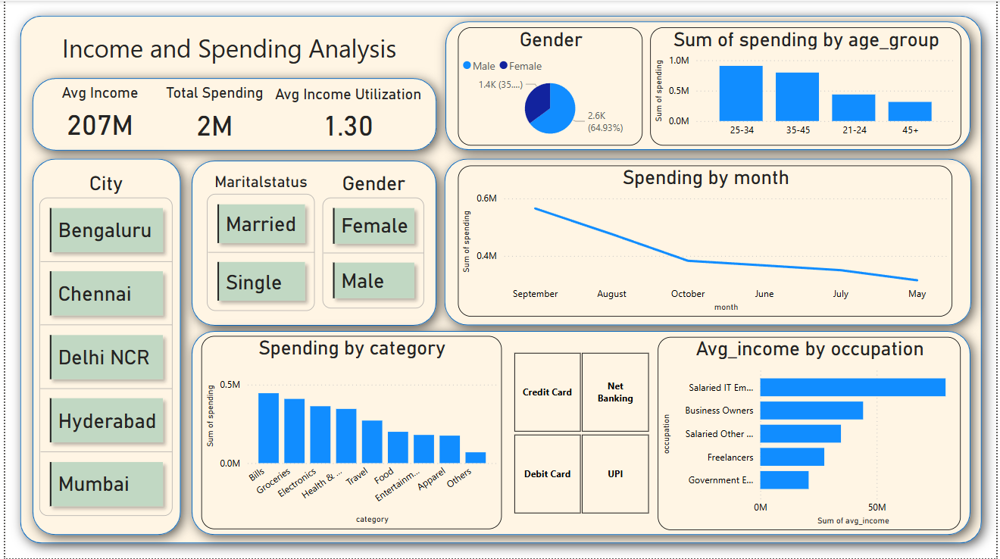

💳 Credit Card Customer Spending Analysis Dashboard
📌 Project Overview
This project focuses on analyzing credit card spending behavior and demographics using Power BI. The dashboard was created for Mitron Bank, a fictional legacy financial institution aiming to launch a new credit card product line. The insights help guide business decisions related to targeting users and marketing strategies.

🎯 Objectives
Understand customer behavior based on age, gender, income, and region.

Identify key spending categories and peak months.

Recommend strategies to increase credit card adoption.

🔍 Key Insights
Highest spending observed among 25–40-year-old salaried IT employees.

Male users have higher average incomes and spending than females.

Bill payments and groceries are the most common spending categories.

Mumbai has the highest average income; Hyderabad has the lowest.

Peak spending months: August (Chennai, Hyderabad) and September (other cities).

21–24 age group shows potential but is underrepresented.

Dashboard Preview

📊 Tools & Technologies
Power BI: Data cleaning, modeling, and visualization

DAX: Custom metrics and calculations

Excel: Source data formatting

PowerPoint: Final report presentation

📁 Project Structure
CreditCardDashboard.pbix – Main Power BI dashboard file

Data.xlsx – Cleaned dataset

Presentation.pptx – Project summary and insights

✅ Outcome
The analysis supports offering bill payment cashback and seasonal promotions during high-traffic months to increase customer usage and acquisition.

